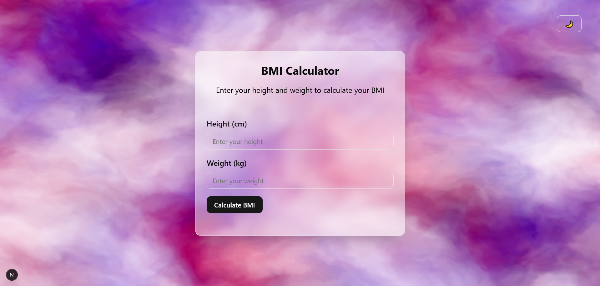

# BMI Calculator

A modern, responsive Body Mass Index (BMI) calculator built with Next.js, TypeScript, and Tailwind CSS. This application helps users calculate their BMI and determine their weight category with an elegant user interface.



## Features

- 📊 Calculate BMI with height and weight inputs
- 🎯 Instant BMI category classification
- ✨ Modern, responsive UI with smooth animations
- 🛡️ Comprehensive input validation
- ⌨️ Keyboard-accessible form controls
- ♿ ARIA-compliant for accessibility
- 🌓 Dark/Light mode support
- ⚡ Real-time error feedback

## Tech Stack

- **Framework:** Next.js 15
- **Language:** TypeScript
- **Styling:** Tailwind CSS v4
- **UI Components:** shadcn/ui
- **State Management:** React Hooks

## Getting Started

### Prerequisites

- Node.js 18+ 
- npm or yarn

### Installation

1. Clone the repository:
```bash
git clone https://github.com/osamabinadnan/bmi-calculator.git
```

2. Navigate to the project directory:
```bash
cd bmi-calculator
```

3. Install dependencies:
```bash
npm install
# or
yarn install
```

4. Run the development server:
```bash
npm run dev
# or
yarn dev
```

5. Open [http://localhost:3000](http://localhost:3000) with your browser to see the result.

## Usage

1. Enter your height in centimeters in the "Height" field
2. Enter your weight in kilograms in the "Weight" field
3. Click "Calculate BMI" or press Enter to see your results
4. View your BMI value and category
5. Input fields will be cleared for new calculations

## Features in Detail

### Input Validation
- Ensures both height and weight are provided
- Validates numeric inputs for positive values
- Sets reasonable limits for height (1-300 cm) and weight (1-500 kg)
- Provides clear error messages for invalid inputs

### BMI Categories
- Underweight: BMI < 18.5
- Normal Weight: BMI 18.5-24.9
- Overweight: BMI 25-29.9
- Obese: BMI > 30

### Accessibility Features
- ARIA labels for form controls
- Role attributes for dynamic content
- Keyboard navigation support
- High contrast color scheme
- Screen reader friendly error messages

## Component Structure

```typescript
BMICalculator/
├── BMI-Calculator.tsx    // Main calculator component
├── ui/                   // UI components
│   ├── button.tsx
│   ├── card.tsx
│   ├── input.tsx
│   └── label.tsx
```

## Contributing

Contributions are welcome! Please feel free to submit a Pull Request.

1. Fork the project
2. Create your feature branch (`git checkout -b feature/AmazingFeature`)
3. Commit your changes (`git commit -m 'Add some AmazingFeature'`)
4. Push to the branch (`git push origin feature/AmazingFeature`)
5. Open a Pull Request


## License

This project is licensed under the MIT License - see the [LICENSE](LICENSE) file for details.

## Acknowledgments

- [Next.js](https://nextjs.org/)
- [Tailwind CSS](https://tailwindcss.com/)
- [shadcn/ui](https://ui.shadcn.com/)

## Contact

Osama Bin Adnan - [@yourlinkedin](https://linkedin.com/in/osamabinadnan)

Project Link: [https://github.com/OsamabinAdnan/Nextjs_Apps/tree/main/30_days_30_projects/11_bmi_calculator](https://github.com/OsamabinAdnan/Nextjs_Apps/tree/main/30_days_30_projects/11_bmi_calculator)

---

Made with ❤️ by Osama Bin Adnan