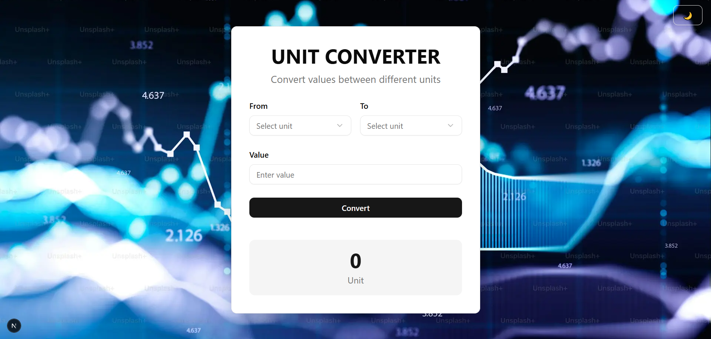

# Unit Converter App

A modern, responsive unit converter built with Next.js, TypeScript, and Tailwind CSS. Features a beautiful animated background and dark/light theme support.



## 🔴 Live Demo

[Live Demo](https://unit-converter-osamabinadnan.vercel.app/)

## ✨ Features

- 📏 Convert between multiple unit types:
  - Length
  - Weight
  - Volume
  - And more...
- 🌓 Dark/Light theme support
- 🎯 Real-time conversion
- 📱 Fully responsive design
- 🔔 Toast notifications for feedback
- 💻 Modern, clean UI

## 🛠️ Built With

- [Next.js 14](https://nextjs.org/) - React Framework
- [TypeScript](https://www.typescriptlang.org/) - For type safety
- [Tailwind CSS](https://tailwindcss.com/) - For styling
- [Shadcn/ui](https://ui.shadcn.com/) - UI Components
- [React Hot Toast](https://react-hot-toast.com/) - For notifications

## 🚀 Getting Started

### Prerequisites

- Node.js (18.x or later)
- npm or yarn

### Installation

1. Clone the repository
```bash
git clone https://github.com/osamabinadnan/unit-converter.git
```

2. Install dependencies
```bash
npm install
# or
yarn install
```

3. Run the development server
```bash
npm run dev
# or
yarn dev
```

4. Open [http://localhost:3000](http://localhost:3000) in your browser

## 📱 Usage

1. Select the input unit from the "From" dropdown
2. Select the output unit from the "To" dropdown
3. Enter the value you want to convert
4. Click "Convert" to see the result
5. Toggle between dark and light themes using the theme switch

## 🧱 Project Structure

```
unit-converter/
├── app/                        # Next.js app directory
├── components/                 # React components
│   ├── ui/                     # UI components
│   └── units.ts                # Unit conversion logic
|   └── Unit-Converter.tsx      # Main app component
├── lib/                        # Utility functions
└── public/                     # Static assets
```

## 🤝 Contributing

Contributions are welcome! Feel free to:

1. Fork the repository
2. Create your feature branch (`git checkout -b feature/AmazingFeature`)
3. Commit your changes (`git commit -m 'Add some AmazingFeature'`)
4. Push to the branch (`git push origin feature/AmazingFeature`)
5. Open a Pull Request

## 📝 License

This project is licensed under the MIT License - see the [LICENSE](LICENSE) file for details

## 🙏 Acknowledgments

- [Shadcn/ui](https://ui.shadcn.com/) for beautiful UI components
- [Next.js](https://nextjs.org/) team for the amazing framework