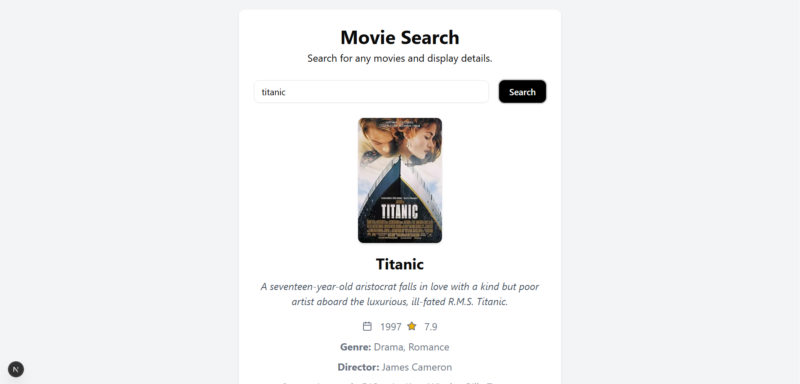

# Movie Search App

This is a Next.js app that allows users to search for movies using the OMDB API and view results in a card-based layout. The app fetches up to 25 pages of results for a given search term and displays them in a responsive grid.

## Local Host Image



## Features

- Search for movies by title using the OMDB API
- Responsive design for desktop and mobile
- Loading and error handling UI

## Getting Started

### Prerequisites
- Node.js (v18 or later recommended)
- npm or yarn

### Installation

1. Clone the repository:
   ```sh
   git clone <your-repo-url>
   cd <project-folder>
   ```
2. Install dependencies:
   ```sh
   npm install
   # or
   yarn install
   ```
3. Create a `.env` file in the root directory and add your OMDB API key:
   ```env
   NEXT_PUBLIC_OMDB_API_KEY=your_omdb_api_key_here
   ```
   You can get a free API key from [OMDB API](https://www.omdbapi.com/apikey.aspx).

### Running the App

```sh
npm run dev
# or
yarn dev
```

Open [http://localhost:3000](http://localhost:3000) in your browser to see the app.

## Project Structure

- `components/`
  - `movie-search.tsx` — Search bar and single movie details
  - `ui/` — Reusable UI components (Card, Button, Spinner, etc.)
- `app/` — Next.js app directory
- `public/` — Static assets

## Customization
- Change the default search term in `movies.tsx` or connect the search bar and results for a more dynamic experience.
- Style components in `components/ui/` as needed.

## License

This project is for educational purposes.
