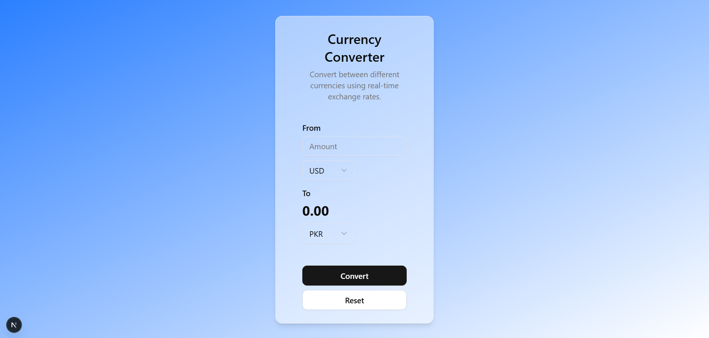

# Currency Converter

A modern, real-time currency converter built with Next.js and TypeScript. This application allows users to convert between different currencies using up-to-date exchange rates.



## Features

- Real-time currency conversion
- Support for multiple currencies (USD, EUR, GBP, JPY, AUD, CAD, PKR, AED, SAR)
- Clean and responsive user interface
- Animated transitions using Framer Motion
- Error handling for failed API requests
- Loading states with visual feedback
- Reset functionality to clear inputs

## Technologies Used

- [Next.js](https://nextjs.org/) - React framework for production
- [TypeScript](https://www.typescriptlang.org/) - For type safety
- [Framer Motion](https://www.framer.com/motion/) - For smooth animations
- [Shadcn UI](https://ui.shadcn.com/) - For UI components
- [Exchange Rate API](https://api.exchangerate-api.com/) - For real-time exchange rates

## Getting Started

1. Clone the repository:
```bash
git clone <repository-url>
```

2. Install dependencies:
```bash
npm install
```

3. Run the development server:
```bash
npm run dev
```

4. Open [http://localhost:3000](http://localhost:3000) with your browser to see the application.

## Usage

1. Enter the amount you want to convert in the "From" input field
2. Select the source currency from the dropdown
3. Select the target currency from the dropdown
4. Click the "Convert" button to see the converted amount
5. Use the "Reset" button to clear all inputs and start over

## Features in Detail

### Real-time Exchange Rates
- Fetches current exchange rates from Exchange Rate API
- Base currency: USD
- Automatically calculates cross-rates for currency pairs

### User Interface
- Responsive design that works on all screen sizes
- Glassmorphism effect with backdrop blur
- Smooth animations on component mount
- Loading spinner during API requests
- Error messages for failed requests

### Input Validation
- Prevents negative amounts
- Handles empty inputs gracefully
- Real-time updates on currency selection

## Contributing

Contributions are welcome! Please feel free to submit a Pull Request.

## License

This project is open source and available under the [MIT License](LICENSE).
